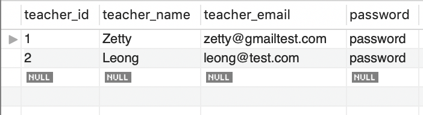
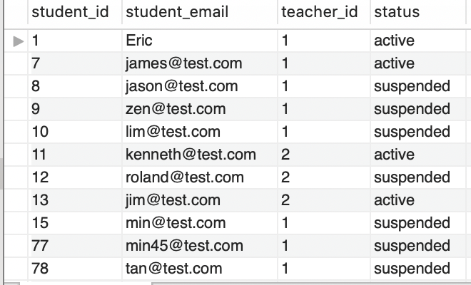
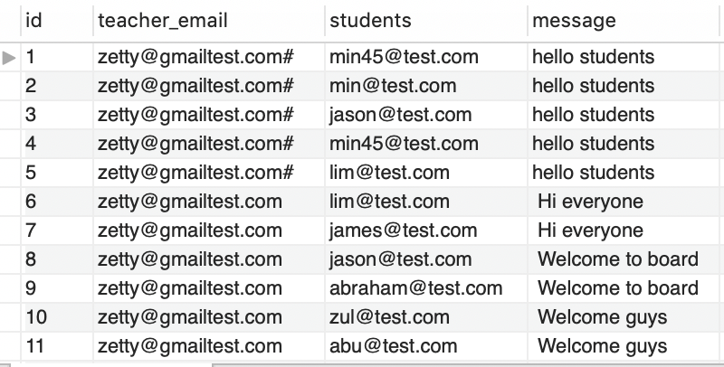

## GovTech Assessment Teacher Portal Setup

### 1.1 Install Node and NPM

In order for the application to run, you will need to install Node and NPM.

Follow the instructions given by the links below depending on your OS.

- [Install Node and NPM for Windows](http://blog.teamtreehouse.com/install-node-js-npm-windows)
- [Install Node and NPM for Linux](http://blog.teamtreehouse.com/install-node-js-npm-linux)
- [nstall Node and NPM for Mac](http://blog.teamtreehouse.com/install-node-js-npm-mac)


### 1.2 Run NPM install

Run the following command in the folder you unzipped the application:
```
npm install
```

### 1.3 Start the Application

**For Linux/MacOS**

Execute the following command to start the application:
```
  ./start.sh
```


**For Windows**

Execute the following command to start the application:
```
  .\start.bat
```


**Access the Application on Your Browser**
You should be able to access the application via the following URL:

```
http://localhost:5000
```
---
## Login with Teacher account

Use this test ID and password to login as Teacher:

I have created two teacher accounts in the DB

Teacher account 2:
email: `zetty@gmailtest.com`
Password: `password`

Teacher account 2:
email: `leong@test.com`
Password: `password`

---
## MySql DB Connection

Local DB connection
Service: Mysql@127.0.0.1:3306
User: root
Password: password

DB Schema:
Table1 : `teachers`

```
column name  	type 
-----------------------
teacher_id		int   (PK)
teacher_name	varchar
teacher_email	varchar
password 		varchar
```


Table2: `students`

```
column name  	type 
-----------------------
student_id		int (PK)
student_email	varchar
teacher_id		int
status 			varchar
```


Table3: `notifications`

```
column name  	type 
-----------------------
id				int  (PK)
teacher_email	varchar
students		varchar
message 		varchar
```


---
### Unit Test
Run the following command in the folder you unzipped the application:
```
npm test
```

---